# Project: Perception Pick & Place

In this project, we built a perception stack on top of a simulated PR2 Robot Arm platform.

The sensors were RGBD cameras implemented through the openni\_kinect plugin in Gazebo, and the perception pipeline consisted of basic pre-processing, segmentation and classification tasks, all of which integrated into a simplistic object recognition system in a fairly minified pick-and-place mission.

Apart from the instability in the manipulation components (which were provided as scaffolding), the perception stack demonstrates near-perfect performance in each of the three tasks.

## Filtering & RANSAC

In the initial phase of the project ("Exercise 1"), we prepared the data for later steps in the pipeline by pre-processing the data. Mainly, this included de-noising, downsampling, and selecting relevant portions of the data (or a *passthrough* filter in PCL).

### Pre-processing

Because the pre-processing pipeline was used in multiple locations throughout the project, I separated them out into a single utilities script.

In particular, the scripts were organized to follow an intuitive pattern that returns a *filtered* output cloud from a given input cloud and the parameters.

See the excerpts from [seg\_utils.py](pr2_robot/src/pr2_robot/seg_utils.py) for details on implementation:

```python
def denoise(cloud, k=50, x=1.0):
    """ Remove noise from the point cloud """
    filter = cloud.make_statistical_outlier_filter()
    filter.set_mean_k(k)
    filter.set_std_dev_mul_thresh(x)
    cloud_filtered = filter.filter()
    return cloud_filtered

def downsample(cloud, leaf=0.025):
    """ Downsample the point cloud to a lower resolution """
    # Voxel Grid filter
    vox = cloud.make_voxel_grid_filter()
    vox.set_leaf_size(leaf, leaf, leaf)
    cloud_filtered = vox.filter()
    return cloud_filtered

def passthrough(cloud, ax='z', axmin=0.6, axmax=1.1):
    """ Select regions in a point cloud by a threshold along axis """
    passthrough = cloud.make_passthrough_filter()
    passthrough.set_filter_field_name(ax)
    passthrough.set_filter_limits(axmin, axmax)
    cloud_filtered = passthrough.filter()
    return cloud_filtered
```

In use, the cloud would simply be filtered in an iterative manner, as in the following example from `PR2Perception.segment()` defined in [pr2\_perception.py](pr2_robot/scripts/pr2_perception.py):

```python
# ... acquire data ...
cloud = seg_utils.downsample(cloud, leaf=0.01)
cloud = seg_utils.passthrough(cloud, ax='y', axmin=-0.5, axmax=0.5)
cloud = seg_utils.passthrough(cloud, ax='z', axmin=0.6, axmax=3.0)
cloud = seg_utils.denoise(cloud, k=50, x=1e-1)
# ... further processing ...
```

Here's how a point cloud from scene 1 would get transformed as it goes across the pre-processing pipeline:

| Raw | Downsample | Pass Y | Pass Z | Denoise |
|-----|------------|--------|--------|---------|
|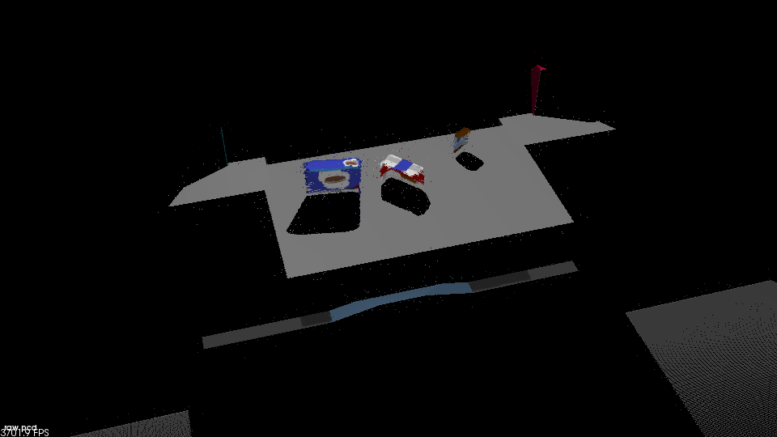|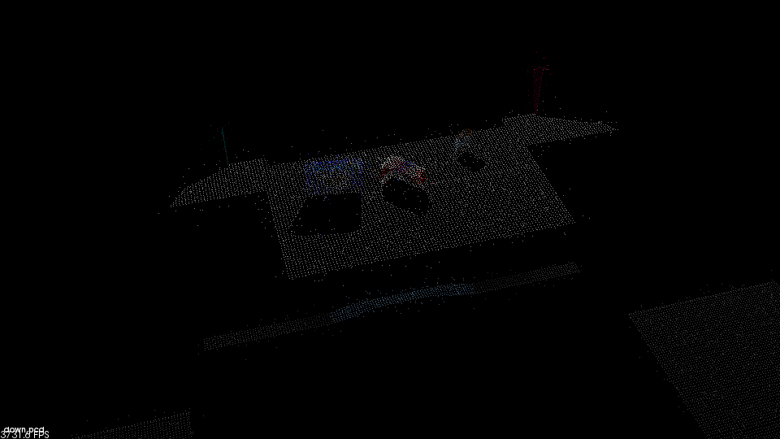|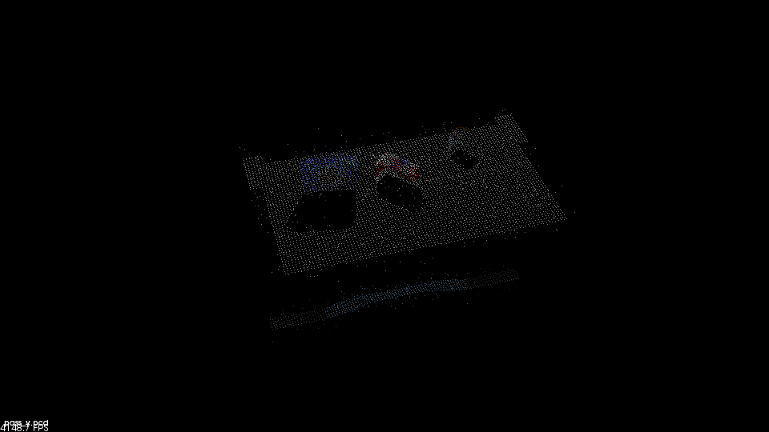|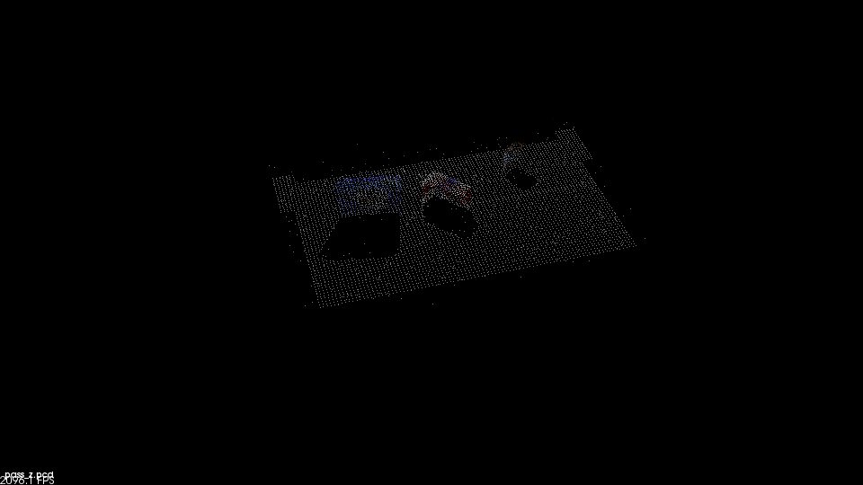|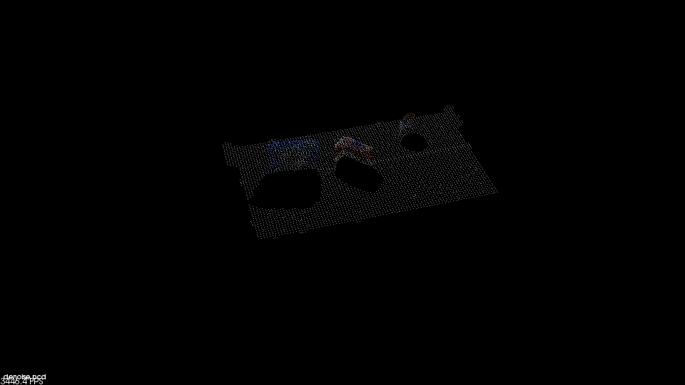|


After these steps, the cloud has been cleaned up sufficiently for higher-level processing steps.

### RANSAC

In order to isolate the table from the objects atop its surface, we simply apply the *plane* model for RANSAC and split the points by whether or not they belong to the plane.

This routine is implemented in [seg\_utils.py](pr2_robot/src/pr2_robot/seg_utils.py) as follows:

```python
def ransac(cloud, dmax=0.01):
    """ Apply a RANSAC Plane model to the point cloud, and return point cloud as (inliers, outliers)."""
    seg = cloud.make_segmenter()
    seg.set_model_type(pcl.SACMODEL_PLANE)
    seg.set_method_type(pcl.SAC_RANSAC)
    seg.set_distance_threshold(dmax)
    inliers, coefficients = seg.segment()

    cloud_table = cloud.extract(inliers, negative=False)
    cloud_objects = cloud.extract(inliers, negative=True)

    return cloud_table, cloud_objects
```

Then used as:

```python
cloud_t, cloud_o = seg_utils.ransac(cloud, dmax=0.02)
```

Which yields two clouds : one that contains the table, and the other that contains all the objects.

After this, the only natural step is to segment the objects to distinguish them from each other.


## Clustering & Segmentation

Again, we utilize the pcl library to apply the euclidean clustering algorithm to the point clouds.

The clustering routine is implemented in [seg\_utils.py](pr2_robot/src/pr2_robot/seg_utils.py):

```python
def cluster(cloud, as_list=False, tol=0.02, min_size=20, max_size=200000):
    """ Apply euclidean clustering algorithm on the point cloud with the given parameters. """
    cloudrgb = cloud #save
    cloud = XYZRGB_to_XYZ(cloud)
    tree = cloud.make_kdtree()
    ec = cloud.make_EuclideanClusterExtraction()
    ec.set_ClusterTolerance(tol)
    ec.set_MinClusterSize(min_size)
    ec.set_MaxClusterSize(max_size)
    ec.set_SearchMethod(tree)
    c_idx = ec.Extract()
    n_c = len(c_idx)
    c_col = get_color_list(n_c)

    if as_list:
        # return each cloud independently
        return [cloudrgb.extract(i) for i in c_idx]
        
    # otherwise, create a representation ...
    cloud = np.float32(cloud)
    res = []
    for i in range(n_c):
        ci = cloud[np.int32(c_idx[i])] # (n, 3)
        m = len(ci)
        col = rgb_to_float(c_col[i])
        col = np.full([m,1], col) # vector
        ci = np.concatenate((ci,col), axis=1) #(n,4)
        res.append(ci)
    res = np.concatenate(res, axis=0) #(n_c*m_c, 4)
    cloud = pcl.PointCloud_PointXYZRGB()
    cloud.from_list(res)
    return cloud
```

And used as:

```python
cloud_os = seg_utils.cluster(cloud_o, as_list=True)
```

The results from the segmentation pipeline will be shown in the next section, as the visualization mostly overlaps with that of classification.

## Classification

After the objects have been segmented, each point cloud is examined for a match to one of the learned objects by the SVM classifier.

Prior to classification, each point cloud is converted as color-norm histogram features for invariance to observed size and position, and orientation.

This is implemented in [features.py](pr2_robot/src/pr2_robot/features.py):

```python
def nhist(xs, *args, **kwargs):
    """ Computes a Cross-Channel Normalized Histogram """
    h = [np.histogram(x, *args, **kwargs)[0] for x in xs]
    h = np.concatenate(h).astype(np.float32)
    h /= np.sum(h)
    return h

def compute_color_histograms(cloud, using_hsv=False, bins=16):
    """ Compute Color Histogram Features with the given colorspace and bin parameter"""
    # Compute histograms for the clusters
    point_colors_list = []

    # Step through each point in the point cloud
    for point in pc2.read_points(cloud, skip_nans=True):
        rgb_list = float_to_rgb(point[3])
        if using_hsv:
            point_colors_list.append(rgb_to_hsv(rgb_list) * 255)
        else:
            point_colors_list.append(rgb_list)

    # Populate lists with color values
    channel_1_vals = []
    channel_2_vals = []
    channel_3_vals = []

    for color in point_colors_list:
        channel_1_vals.append(color[0])
        channel_2_vals.append(color[1])
        channel_3_vals.append(color[2])

    res = nhist([channel_1_vals, channel_2_vals, channel_3_vals], bins=bins, range=[0, 256])
    return res

def compute_normal_histograms(normal_cloud, bins=16):
    """ Compute Normal Histogram Features with the given colorspace and bin parameter """
    norm_x_vals = []
    norm_y_vals = []
    norm_z_vals = []

    for norm_component in pc2.read_points(normal_cloud,
                                          field_names = ('normal_x', 'normal_y', 'normal_z'),
                                          skip_nans=True):
        norm_x_vals.append(norm_component[0])
        norm_y_vals.append(norm_component[1])
        norm_z_vals.append(norm_component[2])
    return nhist([norm_x_vals, norm_y_vals, norm_z_vals], bins=bins, range=[-1,1])
```

As a qualitative assessment of how the features vary statistically across and within objects, I present the box-plot visualization of each object below:

|Object|Feature|Object|Feature|Object|Feature|Object|Feature|
|------|-------|------|-------|------|-------|------|-------|
|biscuits|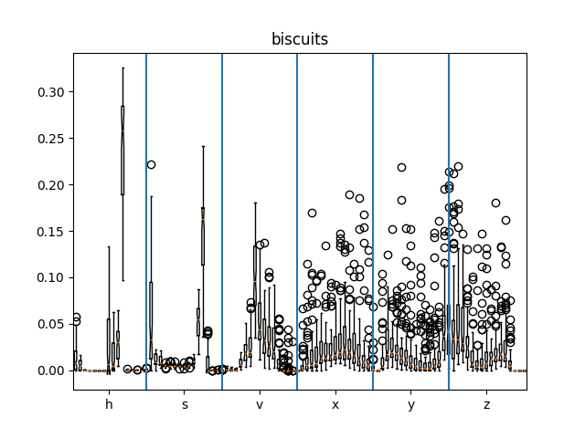|snacks|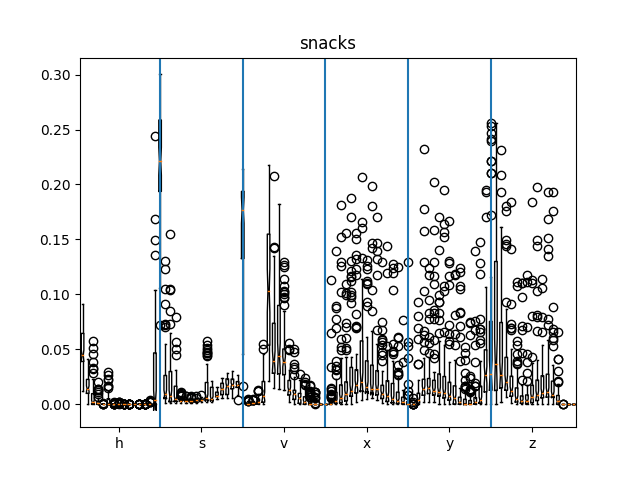|eraser|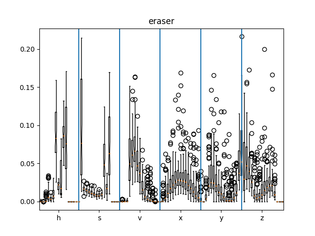|soap2|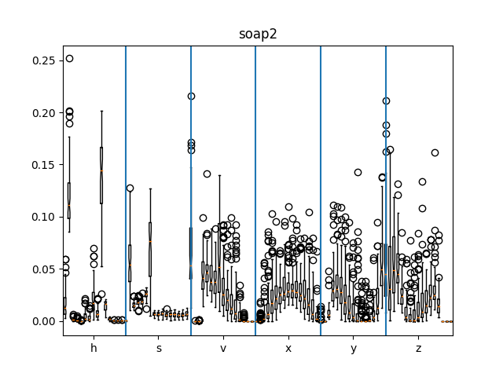|
|book|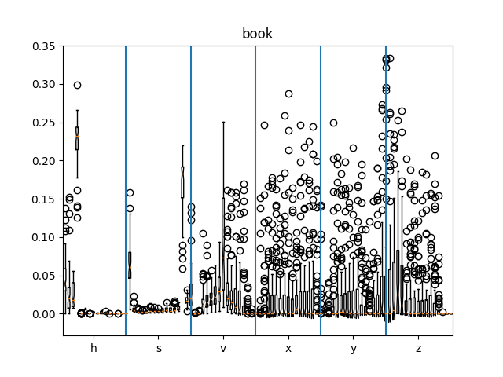|soap|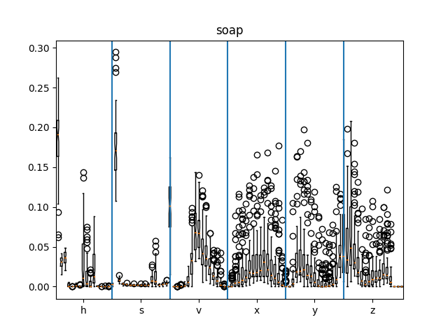|glue|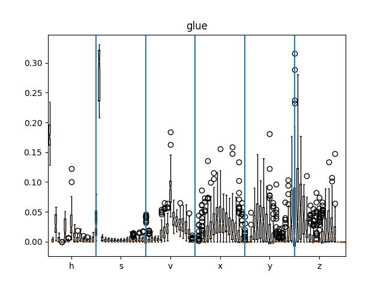|sticky\_notes|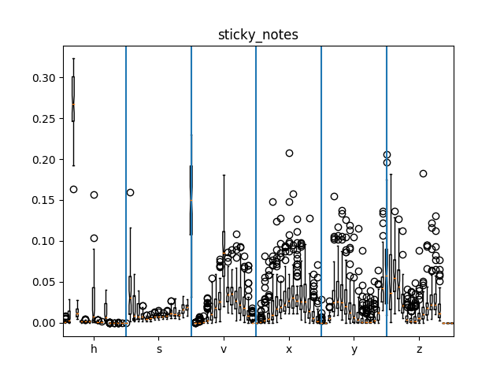|

For robustness, the training sample size on each object was increased to 64, with the hsv-norm histogram feature size of 16\*6 = 96, respectively.
The below confusion matrix demonstrates the performance of the SVM classifier after training:

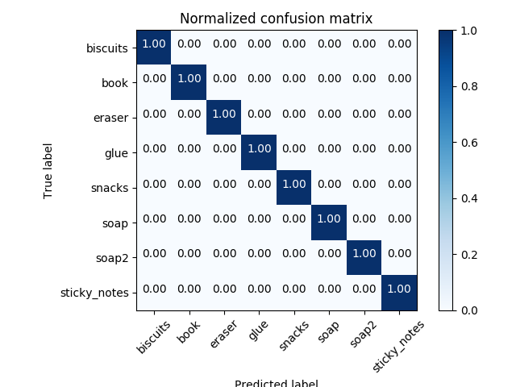

As seen, the classifier performs quite well.

The below figure aptly summarizes the output from the entire perception pipeline:

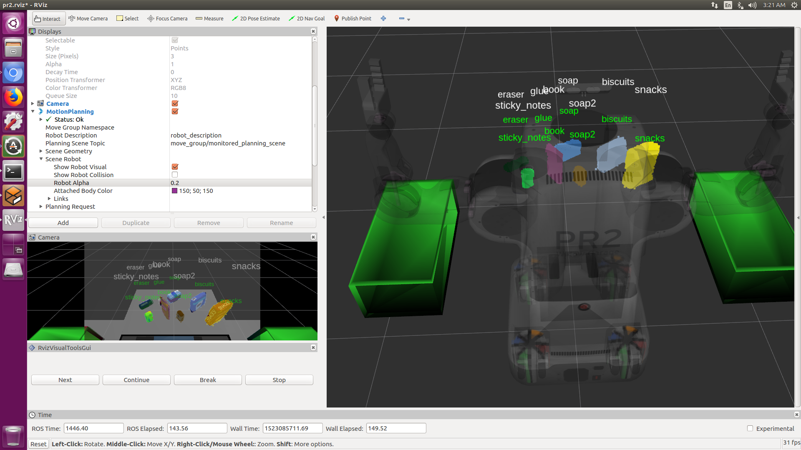

Here, the green labels represent the ground-truth data(as obtained by [ground\_truth\_marker.py](pr2_robot/scripts/ground_truth_marker.py)), and the white labels represent the predicted labels. It is apparent that the two match up quite nicely, even amid a relatively complex scene.

Due to the dependency structure of the pipeline, where the classification performance depends on segmentation, and segmentation on preprocessing, etc., the clean result validates that the rest of the pipeline is fully functional as well.

## Discussion

### Client
With the perception stack complete, I implemented a simple agent to perform the pick and place mission. The implementation is available in [pr2\_pick\_place\_client.py](pr2_robot/scripts/pr2_pick_place_client.py); it simply carries out a phase-wise mission, composed of five main stages in  `PR2PickPlaceClient.run()`:

1. Init:

    Wait for a specified duration (for stability during startup).
    
    ```python
    self._state = 'init'
    self._wait_init = rospy.get_param('~wait_init', default=0.0)
    # ...
    self.wait_for(self._wait_init)
    ```
2. Map:
    
    Build collision map for the robot.
    
    ```python
    self._state = 'map'
    self.clear_map()
    self.set_target('build')
    
    # look around ...
    self.turn_to(0.0)
    self.turn_to(-np.pi/2)
    self.turn_to(np.pi/2)
    self.turn_to(0.0)
    ```
    
3. Data:
    
    Collect Pose-Model association data based on `pr2_perception`.
    
    ```python
    self._state = 'data'
    self.log('State : {}'.format(self._state))
    if not self._static:
        self.wait_for(self._wait_data)
    ```
    
4. Move:

    While objects continue to be detected, the client will request
    the `pick_place_routine` to move objects from the table to the bins.
    
    ```python
    self._state = 'move'
    for object in self._object_names:
        self.clear_map()
        self.set_target(object) # disable publishing point cloud for target
        self._data = [] # clear data, in case stuff got knocked over
        self._state = 'data' # temporarily collect data
        self.wait_for(self._wait_data)
        # stop point cloud, prevent arm from getting included in collision map
        self.set_target('')
        self._state = 'move'
        suc = self.move(object)
        rospy.loginfo_throttle(1.0, "[{}] Move Success : {}".format(object, suc))
        ```
5. Done:

    After all the objects have been placed properly, the client will save the collected data if `save_yaml` option is set, and terminate the program.
    
    ```python
    self._state = 'done'
    if self._save_yaml:
        self.save()
    ```

As for the utility functions invoked within the above logic functions, refer to the [script](pr2_robot/scripts/pr2_pick_place_client.py); it is fairly intuitive and doesn't require excessive descriptions.

### Results

[Demo Video (Scene 3)](https://youtu.be/eIKzhQQPRTI) is currently hosted on youtube. Although the output results from the video itself may be slightly different from the ones you may see during execution, it shouldn't deviate too much from it.

To reproduce the results, simply follow the below steps sequentially:

```
export SCENE=3
roscore
roslaunch pr2_robot pick_place_project.launch scene:=${SCENE}
roslaunch pr2_robot pr2_pick_place_client.launch scene:=${SCENE}
rosrun pr2_robot pr2_perception.py 
```

In each of the above steps, either open it in a screen session, or run each command on a new tab.

Output YAML file links: [(1)](pr2_robot/config/output_1.yaml) [(2)](pr2_robot/config/output_2.yaml) [(3)](pr2_robot/config/output_3.yaml)

### Next Steps

I'll be discussing the issues that arose within the project later, but the biggest failure point did not arise from the part that I was expected to implement. After too many frustrations, it was very difficult to devote my time into implementing something *beyond* the required functions. If I were to pursue this project further, I would probably write the entire thing from scratch -- including the faulty trajectory planner, disfunctional grasp plugin, frustrating collision-map plugin, and avoid the python\_pcl binding that is way too limited and write a separate C++ node for perception.

## Issues

There were a number of issues that I had encountered throughout this project; some of them were related to perception directly, and others were more about insufficient scaffolding in the provided motion-planning pipeline.

### Data Collection

The first issue I encountered was with poor performance in perception, where it appeared that some objects were indistinguishable to the SVM classifier despite obvious differences in color features -- almost as though the classifier was fully reliant on geometric features without taking the object's visuals into account. This was difficult to debug, as it was part of the pipeline that I believed was independent of my implementation, meaning that it *should* have been functional.


After further examination of the data, and looking at the histograms, I realized that the input data was *corrupted* : in that many of the colors for the object were simply replaced with grey. This anomaly was due to some latency issues in loading the colors while the point-cloud data was captured, as seen above with a transient period of grey point-cloud. I ultimately settled on setting a delay of 1.0 second after spawning and re-orienting the object, before capturing the data, to avoid this issue. This rendered the data collection process rather long and tedious, but it was automated so I could afford to wait while working on other parts of the implementation.

### Trajectory Planning

#### Failing to account for collision


Often, the computed trajectory would fail to account for collision - in that it would either ram into the table or run into nearby objects, shifting their positions.

Because the `pick_place_server` completely overrides the student's selection of the pick pose, and simply fails if the hard-coded pose is inconsistent with the requested pose, the robot will never be able to recover an object that's been displaced from its original position. *Note* that this issue cannot be solved simply by providing the collision map for moveit -- see below issues for complications that prevent this from happening.

#### Issues with Collision

##### Transformations

The provided `point_cloud_transformer` node transforms all of the point clouds in the `world` frame, which isn't compatible with how `PointCloudOctomapUpdater` is configured. While I understand that this *may* have simplified the implementation, this meant that all of the point-cloud inputs needed to be transformed to the coordinate frame of the camera in order to be cleared/modified properly based on its raycasting methods -- if clearing collision maps worked at all, that is.

##### Clearing Collisions

Without a good method to clear a *portion* the previous map built by `PointCloudOctomapUpdater`, the only way to disable collisions for the target object is to either completely clear the octomap and rebuild it from currently visible objects from scratch, effectively discarding all prior mapping information, or hold onto an internal map of the environment to provide to the map-builder plugin (which renders the plugin useless, anyways). Even so, I continued to have collision issues around trajectory planning, and ultimately had to give up on building the collision map for use for the arm.

### Grasping

As an unrelated issue - there is no clear signal that indicates that grasping is complete, and the provided implementation simply **waits** for a fixed time and assumes that the grasping action is complete. This is completely false information, and basically prohibits the `continue` option on the RVIZ tools from operating at all. Faced with a partially-functional grasp feedback, I was forced to manually click through each options for each iteration, on top of each iteration being painful due to the numerous failures in the pipeline.

## Conclusion

Overall, while I recognize the educational value of the project, I felt that the project involved unnecessary pains and was poorly prepared.

As someone who had tried to setup a ROS integration of a robotic arm with perception capabilities before (see [st\_r17\_ros\_driver](https://github.com/yycho0108/st_r17_ros_driver)) and had undergone some hardships along the way, I was hoping to see a *model* example of how this would be done well, but it did not quite meet my expectations.

That said, the parts of the project that were most frustrating were not directly related to *perception*, which was the aim of this project. Dealing with RGB-D data and working on the perception stack instilled some degree of confidence in me for working with point clouds, which I'm fairly happy about.