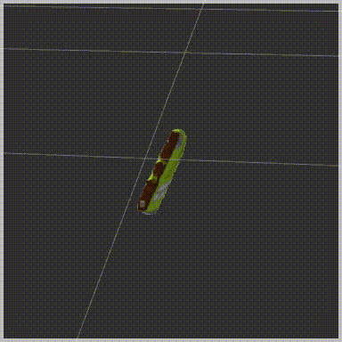

# Project: Perception Pick & Place
    
## Exercise 1 : Filtering & RANSAC

### Pre-processing

```python
cloud = seg_utils.downsample(cloud, leaf=0.01)
cloud = seg_utils.passthrough(cloud, ax='y', axmin=-0.5, axmax=0.5)
cloud = seg_utils.passthrough(cloud, ax='z', axmin=0.6, axmax=3.0)
cloud = seg_utils.denoise(cloud, k=50, x=1e-1)
```

### RANSAC

```python
cloud_t, cloud_o = seg_utils.ransac(cloud, dmax=0.02)
```

## Exercise 2 : Clustering & Segmentation

```python
cloud_os = seg_utils.cluster(cloud_o, as_list=True)
```

Where, in [seg\_utils.py](pr2_robot/src/pr2_robot/seg_utils.py):

```python
def cluster(cloud, as_list=False, tol=0.02, min_size=20, max_size=200000):
    cloudrgb = cloud #save
    cloud = XYZRGB_to_XYZ(cloud)
    tree = cloud.make_kdtree()
    ec = cloud.make_EuclideanClusterExtraction()
    ec.set_ClusterTolerance(tol)
    ec.set_MinClusterSize(min_size)
    ec.set_MaxClusterSize(max_size)
    ec.set_SearchMethod(tree)
    c_idx = ec.Extract()
    #print np.shape(c_idx)
    #print np.max(c_idx)
    n_c = len(c_idx)#1 + np.max(c_idx)
    c_col = get_color_list(n_c)

    if as_list:
        # return each cloud independently
        return [cloudrgb.extract(i) for i in c_idx]

    cloud = np.float32(cloud)
    res = []
    for i in range(n_c):
        #print c_idx[i]
        #print np.int32(c_idx[i])
        ci = cloud[np.int32(c_idx[i])] # (n, 3)
        m = len(ci)
        col = rgb_to_float(c_col[i])
        col = np.full([m,1], col) # vector
        ci = np.concatenate((ci,col), axis=1) #(n,4)
        res.append(ci)
    res = np.concatenate(res, axis=0) #(n_c*m_c, 4)
    cloud = pcl.PointCloud_PointXYZRGB()
    cloud.from_list(res)
    return cloud
```


## Exercise 3 : Classification

## Discussion

[Demo Video (Scene 3)]()

Output YAML file links: [(1)](pr2_robot/config/output_1.yaml) [(2)](pr2_robot/config/output_2.yaml) [(3)](pr2_robot/config/output_3.yaml)


Spend some time at the end to discuss your code, what techniques you used, what worked and why, where the implementation might fail and how you might improve it if you were going to pursue this project further.

After too many frustrations, it was very difficult to devote my time into implementing something *beyond* the required functions. If I were to pursue this project further, I would probably write the entire thing from scratch -- including the faulty trajectory planner, disfunctional grasp plugin, useless collision-map plugin, and avoid the python\_pcl binding that is way too limited and write a separate C++ node for perception.

## Issues

There were a number of issues that I had encountered throughout this project; some of them were related to perception directly, and others were more about insufficient scaffolding in the provided motion-planning pipeline.

### Data Collection

The first issue I encountered was with poor performance in perception, where it appeared that some objects were indistinguishable to the SVM classifier despite obvious differences in color features -- almost as though the classifier was fully reliant on geometric features without taking the object's visuals into account. This was difficult to debug, as it was part of the pipeline that I believed was independent of my implementation, meaning that it *should* have been functional.



After further examination of the data, and looking at the histograms, I realized that the input data was *corrupted* : in that many of the colors for the object were simply replaced with grey. This anomaly was due to some latency issues in loading the colors while the point-cloud data was captured, as seen above with a transient period of grey point-cloud. I ultimately settled on setting a delay of 1.0 second after spawning and re-orienting the object, before capturing the data, to avoid this issue. This rendered the data collection process rather long and tedious, but it was automated so I could afford to wait while working on other parts of the implementation.

### Trajectory Planning

#### Failing to account for collision


Often, the computed trajectory would fail to account for collision - in that it would either ram into the table or run into nearby objects, shifting their positions.

Because the `pick_place_server` completely overrides the student's selection of the pick pose, and simply fails if the hard-coded pose is inconsistent with the requested pose, the robot will never be able to recover an object that's been displaced from its original position.

#### Issues with Collision

##### Transformations

The provided `point_cloud_transformer` node transforms all of the point clouds in the `world` frame, which isn't compatible with how `PointCloudOctomapUpdater` is configured. While I understand that this *may* have simplified the implementation, this meant that all of the point-cloud inputs needed to be transformed to the coordinate frame of the camera in order to be cleared/modified properly based on its raycasting methods -- if clearing collision maps worked at all, that is.

##### Clearing Collisions

Without a good method to clear a *portion* the previous map built by `PointCloudOctomapUpdater`, the only way to disable collisions for the target object is to either completely clear the octomap and rebuild it from currently visible objects from scratch, effectively discarding all prior mapping information, or hold onto an internal map of the environment to provide to the map-builder plugin (which renders the plugin useless, anyways). Even so, I continued to have collision issues around trajectory planning, and ultimately had to give up on building the collision map for use for the arm.

### Grasping

There is no clear signal that indicates that grasping is complete, and the provided implementation simply **waits** for a fixed time and assumes that the grasping action is complete. This is completely false information, and basically prohibits the `continue` option on the RVIZ tools from operating at all. Faced with a partially-functional grasp feedback, I was forced to manually click through each options for each iteration, on top of each iteration being painful due to the numerous failures in the pipeline.

## Conclusion

Overall, while I recognize the educational value of the project, I felt that the project involved unnecessary pains and was poorly prepared.